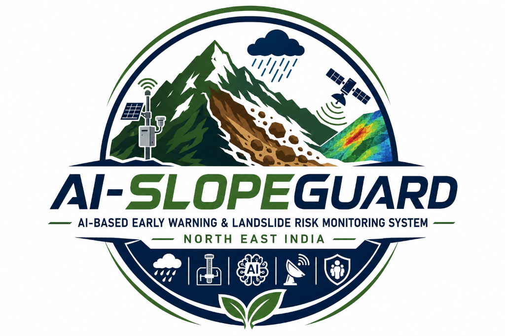

<div align="center">
  
  <h1>AI-SlopeGuard: AI-Based Early Warning & Landslide Risk Monitoring System</h1>
  <h3>Government of India • Disaster Intelligence Command Center for North Eastern Region</h3>
  <p><b>National Disaster Management Authority (NDMA) • Smart India Hackathon</b></p>
</div>

**AI-SlopeGuard** is a high-performance, government-grade landslide early warning and spatial risk monitoring command platform designed specifically for the fragile geology, steep terrain, and extreme monsoonal precipitation of India's North Eastern Region (NER: Arunachal Pradesh, Sikkim, Assam, Meghalaya, Nagaland, Manipur, Mizoram, Tripura).

---

## Key System Capabilities

1. **Live Interactive GIS Risk Map**: Multi-layer MapLibre/Leaflet canvas with Carto Dark Matter, high-resolution terrain, satellite imagery, GeoJSON hazard polygons, and real-time station nodes.
2. **Physics-Informed AI/ML Risk Forecasting**: Combines geotechnical Infinite Slope Factor of Safety ($FoS$) equations with gradient boosted decision trees (XGBoost) to project landslide probability across **1h, 6h, 24h, and 72h** horizons.
3. **Transparent Explainability (SHAP-Style Feature Attribution)**: Direct attribution waterfalls detailing why a slope is at risk (Rainfall, Soil Saturation, Slope Angle, Ground Creep, Elevation/Curvature) with plain-English NDMA advisories.
4. **Interactive Hackathon Stress Simulation Sandbox**: Dynamic real-time sliders for precipitation surges (up to 280mm), volumetric soil saturation, and wire extensometer displacement with instant risk and alert recalculation.
5. **IoT LoRaWAN & MQTT Ground Telemetry**: Real-time monitoring of 25+ station nodes with battery levels, radio signal RSSI, sampling intervals, and fault injection.
6. **Earth Observation & InSAR Satellite Analysis**: Sentinel-1A SAR interferometric surface deformation monitoring and interactive Before/After spectral change detection slider.
7. **Geofenced Location Warning**: Simulated citizen proximity alert detecting presence within 2.0 km of active slope failure.
8. **Emergency Evacuation Corridor Routing**: Automatic corridor plotting avoiding blocked highway segments (NH-13, NH-10) to designated relief shelters and trauma hospitals.
9. **Official Report Generation**: Instant printable and downloadable daily, weekly, and incident assessment reports adhering to NDMA/SDMA formats.

---

## Monorepo Architecture

```
p1/
├── backend/
│   ├── app/
│   │   ├── api/          # 15+ REST endpoints & WebSocket live stream
│   │   ├── core/         # Config, security, JWT authentication
│   │   ├── database/     # SQLite / In-Memory fallback & PostGIS scripts
│   │   ├── ml/           # Geotechnical Factor of Safety & XGBoost predictor
│   │   ├── mock_data/    # NER geospatial coordinates, sensors, historical data
│   │   └── main.py       # FastAPI application entrypoint
│   ├── requirements.txt
│   └── run.py            # Local backend server runner
├── frontend/
│   ├── src/
│   │   ├── components/   # GIS canvas, slide drawer, simulation HUD, KPI cards
│   │   ├── pages/        # All 18 functional pages (Dashboard, GIS Map, Prediction, etc.)
│   │   ├── services/     # REST client & WebSocket listener
│   │   ├── types/        # TypeScript data models
│   │   ├── App.tsx
│   │   └── index.css     # Dark tactical command center stylesheet
│   ├── package.json
│   └── vite.config.ts
├── database/
│   └── schema.sql        # PostgreSQL 16 + PostGIS production DDL
├── ml/
│   ├── train_model.py    # Model calibration & dataset generator
│   └── synthetic_dataset.csv
├── iot-simulator/
│   └── simulator.py      # Telemetry generator with drift & anomaly simulation
├── docker/
│   ├── Dockerfile.frontend
│   ├── Dockerfile.backend
│   └── docker-compose.yml
├── .env.example
└── README.md
```

---

## Demo Credentials & Access Roles

| Role | Username | Password | Jurisdiction |
| :--- | :--- | :--- | :--- |
| **Super Admin** | `admin` | `Password123!` or `demo` | All 8 North Eastern States |
| **Disaster Officer** | `officer` | `Password123!` or `demo` | Tawang & West Kameng Sectors |
| **Geotech Analyst** | `analyst` | `Password123!` or `demo` | NER Geospatial Modeling Lab |

---

## Quick Start & Run Instructions

### 1. Launch Backend (FastAPI)
```powershell
cd backend
py -m pip install -r requirements.txt
py run.py
```
Backend will be active at `http://127.0.0.1:8000` (API Docs: `http://127.0.0.1:8000/docs`).

### 2. Launch Frontend (React + Vite)
```powershell
cd frontend
npm install
npm run dev
```
Frontend will be active at `http://localhost:5173`.

### 3. Full Docker Deployment
```bash
docker-compose -f docker/docker-compose.yml up --build
```

---

## 11-Step Hackathon Demonstration Script

1. **Step 1 - Open Dashboard (`/`)**: View 8 KPI metrics (Rainfall, Soil Moisture, Active Alerts, Landslide Probability, IoT Health) with trend sparklines and active alert banner.
2. **Step 2 - Open Live GIS Risk Map (`/map`)**: Switch base layers (Satellite, Terrain, Dark); click Tawang or Gangtok polygon to open the slide-out inspection drawer displaying geotechnical parameters.
3. **Step 3 - Navigate to Simulation Mode (`/simulation`)**: Slide rainfall from 85mm to 195mm and soil moisture to 88%.
4. **Step 4 - Extensometer Displacement**: Slide ground movement from 1.8mm to 5.2mm.
5. **Step 5 - AI Dynamic Recalculation**: Observe probability gauge surge to 89.5% with Factor of Safety dropping below 1.0 (Critical).
6. **Step 6 - Hazard Color Transition**: Observe polygon transition from Amber to glowing Red on the simulation mini-map.
7. **Step 7 - Inspect AI Explainability (`/prediction`)**: View SHAP-style waterfall proving precipitation (+38%) and saturation (+27%) drove the hazard spike.
8. **Step 8 - CAP Alert Generation (`/alerts`)**: Acknowledge and dispatch an emergency Common Alerting Protocol broadcast.
9. **Step 9 - Location Warning Modal (`/location-warning`)**: Test simulated browser geofencing proximity alert within 2km of the slope.
10. **Step 10 - Emergency Response Routing (`/emergency`)**: View planned safe evacuation route avoiding blocked NH-13 sections to the designated shelter.
11. **Step 11 - Export Audit Report (`/reports`)**: Generate and print the official NDMA Daily Landslide Hazard Assessment Report.
